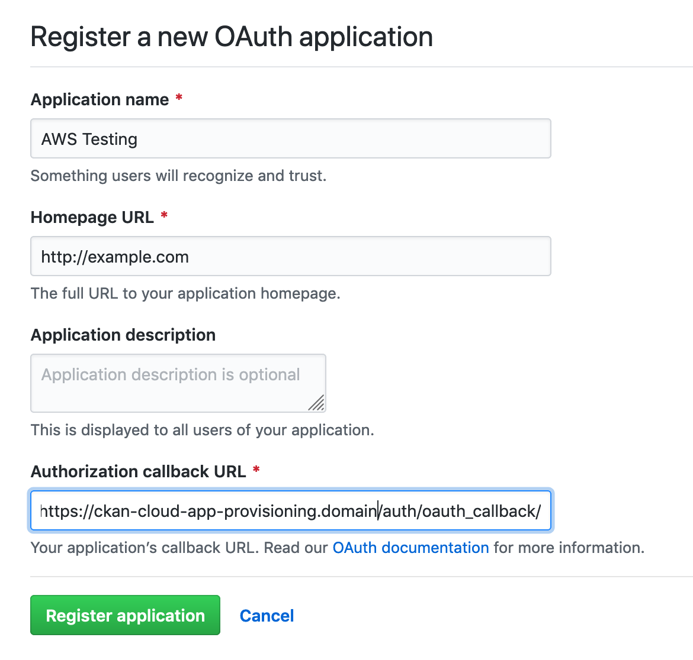

# Provisioning server

## Enable Jenkins

- In the browser, open `http://<management-server-url>:8080`

  (you might need to update or create a security group / firewall rule to allow TCP Port 8080)

- Jenkins will ask you to input an 'unlock code' - follow the instructions to unlock Jenkins

- Create an `admin` user

- In the admin user profile page, use 'configure' to generate an API Token (copy it to somewhere safe to be used later)

## Create the provisioning app

- Update `sample-values/provisioning.yaml` to contain the correct domain name (look for `apiExternalAddress`)

- Run

```bash
$ ckan-cloud-operator apps deployment helm create \
    --app-type provisioning \
    --instance-id provisioning \
    --instance-name provisioning \
    --update \
    --values-filename sample-values/provisioning.yaml
```

- Create a private / public keypair

```bash
openssl genrsa -out .tmpkey 2048
openssl rsa -in .tmpkey -out private.pem -outform pem
openssl rsa -in .tmpkey -out public.pem -outform pem -pubout
rm .tmpkey
```

- Create a GitHub app for authentication and copy the key / secret. Make sure you use the correct callback URL based on your external domain:



- Create a secret in the provisioning namespace

```bash
kubectl create secret generic -n provisioning api-env \
            --from-literal GITHUB_KEY=bcddcc9e365a6be0e37f \
            --from-literal GITHUB_SECRET=b592bc35986dfa4c1f1310d4e7671cf2199d875c \
            --from-literal JENKINS_ENDPOINT=http://ec2-3-9-13-131.eu-west-2.compute.amazonaws.com:8080 \
            --from-literal JENKINS_TOKEN=11978b0c3303c740763e6373cc99db6729 \
            --from-literal JENKINS_USER=admin \
            --from-file PRIVATE_KEY=private.pem \
            --from-file PUBLIC_KEY=public.pem
```

- Try to login to the provisioning UI in https://ckan-cloud-app-provisioning.<your-domain>

  It should say you don't have access and show you the email address associated with your GitHub account.

  Add it to the database and then try again:

```bash
kubectl get pods -n provisioning
# Copy the name of the API pod
kubectl exec -n provisioning <api-pod-name> -c db -- /usr/bin/psql -U postgres -c "insert into mcp_users values ('<your-email-address>','{\"level\": 2}')"
```

